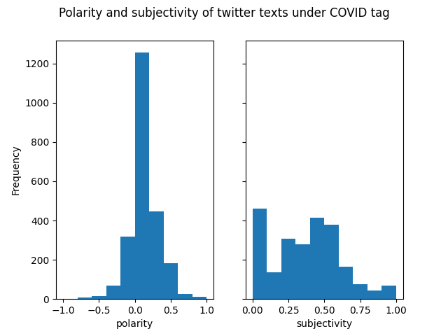
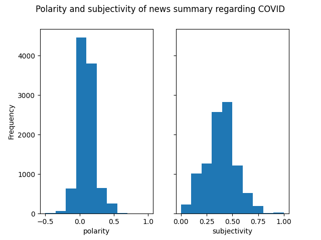
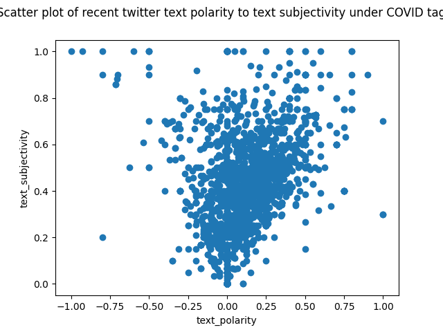
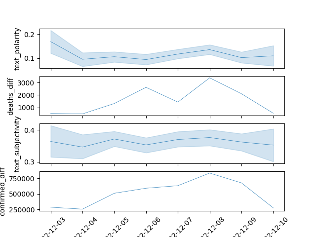
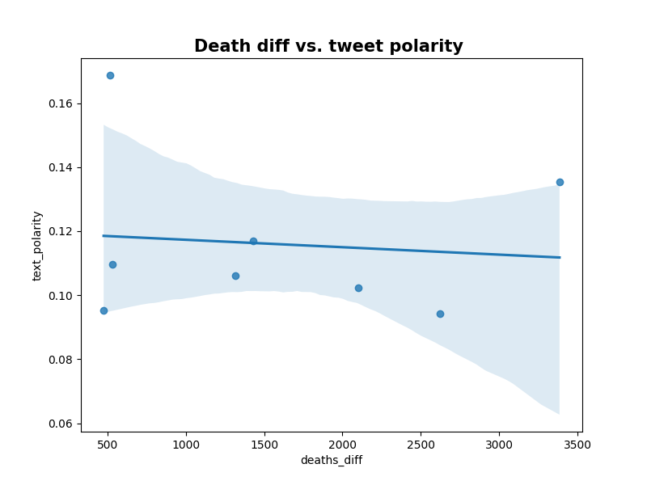
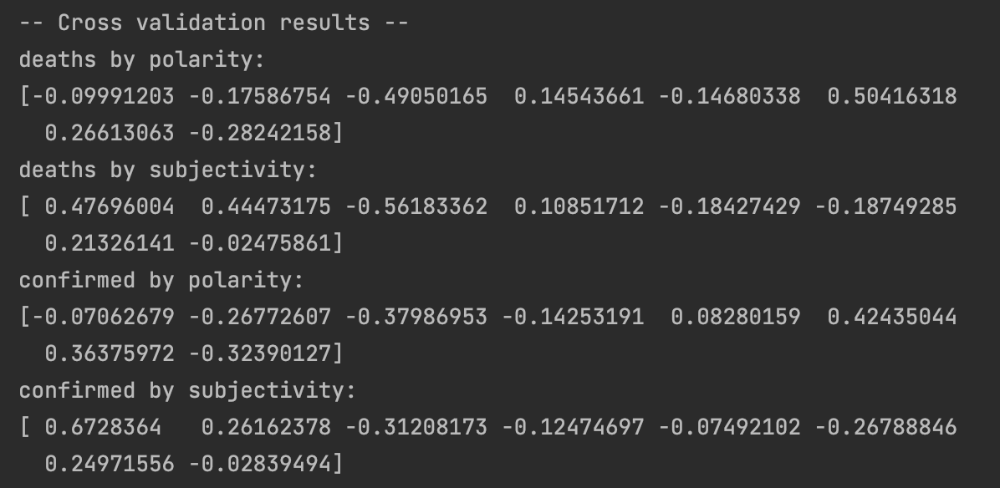

 # 510-FinalProject-Francesca Zhang
 # Public Media and COVID-19: An overview on the public sentiment and COVID-19 severity
Link to github: https://github.com/francescazhang92/510-FinalProject
## Description:
This project is an analysis of how COVID-19 severity impacts
the public's sentiment and subjectivity. Based on the twitter 
data regarding COVID-19 and the COVID-19 statistics (death 
increase, confirmed cases), I attempted to find the correlation 
between the sentiment and virus severity. 

## Usage / How to run this project:
Download all the files in code and data folder. 

**IMPORTANT**: Due to various kinds 
of API constraints, it is difficult to reproduce the data
collection process for the news data and the twitter data,
so please download the two csv files in the data folder as well. 

Package dependencies are listed in the requirements.txt. To install them
, type python3 -m pip install -r requirements.txt in the command 
line in the main directory.

Before running the visualization code, make sure covid_news_recent
.csv and covid_tweets.csv are downloaded correctly under 510-FinalProject/data directory. 
Then, in the 510-FinalProject directory, in the command line, type "cd code" to change 
current the working directory to 510-FinalProject/code. Then, simply type "python3 ./visualization_and_analysis.py" to generate
the visualizations and analysis. 

## Data collection
### covid_tweets.csv 
This is the data of 2000 recent tweets collected by covid_tweets.py 
from the official twitter API. The twitters filtered by "COVID19" 
tag and "verified users" from last week are retrieved through the 
essential plan of twitter's endpoint: api.twitter.com/2/tweets/search/recent

With each individual tweet searched and obtained, after unpacking its json form, 
its id, creation_time and text are preserved, and further 
data cleaning (removing redundant white spaces, links, etc.) is then performed. 

Due to twitter's restriction on the access, it is not possible to 
reproduce the collection of this data, since only one recent week 
of data could be collected through the API. This poses a great challenge 
for my initial plan, so eventually I have to deviate from the original 
plan and accommodate to this fact by analyze the most recent week's 
data only.

### covid_news_recent.csv
This is the data of 10000 recent news collected by covidnews.py. 
It contains the news regarding COVID-19 from newscatcher API, 
through the endpoint "https://covid-19-news.p.rapidapi.com/v1/covid".

With each individual news obtained, after unpacking its json form, 
its title, summary, and published_date are preserved.

Due to the API's bandwidth restriction, only a limited amount of 
data can be retrieved every minute. Thus, this data collection 
process for 10000 entries could take about thirty minutes or more. 

### COVID-19 statistics 
This is collected directly from "COVID 19" API: "https://covid-
19-statistics.p.rapidapi.com/reports/total". It contains various
information about COVID-19, including daily death difference and
daily confirmed cases difference in USA only. 

## Analysis, visualization, and discussion
### Data processing: 
The TextBlob library is used in this project to perform sentiment analysis on tweets and news.
In each textual data, its polarity (from 1, positive, to -1, negative sentiment) and subjectivity
(from 0, totally objective, to 1, totally subjective) are drawn. 

### Explanatory analysis and data visualization

Fig1, Fig2: Histogram of the polarity and subjectivity of 
the tweet dataset and the news dataset, respectively.

**Findings**: All approximately normal distribution. 
SD for tweets on subjectivity is larger than the SD for news. 
This is expected, since the tweets can contain more 
personal opinions than newspapers. 

Fig3: Histogram of the polarity and subjectivity of 
the tweet dataset and the news dataset, respectively.

**Findings**: Most texts that are neutral in sentiment, 
are also neutral in subjectivity. 
As subjectivity increases, the variation in 
corresponding polarity also increases.

Fig4: Time series plot of the last week’s death/confirmed number 
and tweet sentiments

**Findings**: Can see a slight relationship in the pattern 
of the two. Need more systematic analysis to confirm.

## Correlation and Cross-correlation analysis

Fig5: Correlational analysis of death case and polarity as a example

**Findings**: As can be seen directly, 
no correlation is observed between COVID-stat and polarity 
of tweets, regardless of the time series.

This result shows four pairs of cross-correlational analysis between the time series
data. The ith index represents the correlation of data at lag i. 

**Findings**: This result suggests that there exhibits some moderate to strong relationship
between subjectivity and COVID-stats, but not polarity. The correlation between subjectivity
and confirmed cases is 0.67 at lag = 0, meaning that there might exist a decent relationship 
between people's subjectivity in their argument on COVID-19 and the spread of COVID-19. This 
correlation diminished after lag = 2. These findings show correlation to some extent, but 
it is not appropriate to conclude that this relationship actually exists, since we only have 
very few datapoints in the time series. the power of our result is questionable. 

## Future Works
As mentioned in the previous discussion, with the limited amount of data, it is impossible 
to generate a powerful conclusion. Thus, one major future work on this project is to collect
the stream of data using the limited APIs continuously daily, so that it is possible to 
perform an analysis in a long run. Only in that case, more significant conclusion can possibly be
drawn. 

Also, since twitter cannot be representative of the public media, more data can be collected
from various different kinds of public media platform for further study. 

## Codes and modules usage
### visualization_and_analysis.py 
routine that can process and generate visualization and analysis to the data
### covidnews.py 
covid_news.py is a script that can retrieve news related 
to COVID given a time period into csv file as commandline 
argument (yyyy/mm/dd). Due to the limit in access rate,
this script requires about 30 minutes to retrieve 10000 
sample. Because of this, a sample file contains 10000 line
of news is given as covid_news.csv 
### covid_tweets.py
it is a script that can collect the tweets from the recent week and cleaned them into csv file, given an argument on the maximum number of tweets.
### covid_stats.py
a module that collects the statistics of COVID in the recent week
